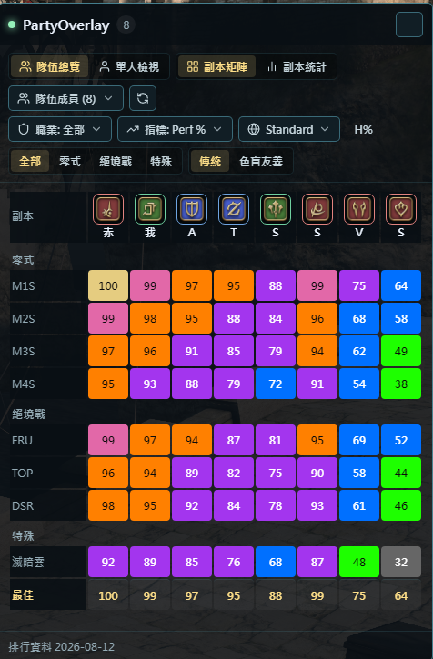

# PartyOverlay

一款 [OverlayPlugin](https://github.com/OverlayPlugin/OverlayPlugin) Addon 插件，為 FFXIV ACT 提供**隊伍成員 FFLogs 排行即時總覽**。組隊後自動偵測隊伍成員，即時查詢並展示每位成員在各副本的 Percentile（PR）數據。



## ✨ 功能特色

- **自動隊伍偵測** — 透過記憶體讀取即時取得隊伍成員資訊，支援跨伺服器 / 跨 DC 隊伍
- **FFLogs PR 矩陣** — 以副本×成員矩陣一覽全隊各副本 Percentile
- **副本統計模式** — 針對單一副本展示全隊詳細數據（最佳 / 中位數 Percentile、通關次數、最快時間等）
- **單人檢視模式** — 查看個別成員的完整副本歷史戰績
- **多指標支援** — 切換 rDPS / aDPS / nDPS / cDPS / HPS / Perf% 等指標
- **分區版本切換** — Standard / Current Patch / All Partitions
- **職業篩選** — 按職責（Tank / Healer / DPS）或具體職業過濾
- **FFLogs 色階** — 傳統 FFLogs 色階（灰綠藍紫橘粉金）與色盲友善色階
- **折疊式 UI** — 不需要時可收合為僅標題列
- **自動更新** — 插件啟動時自動檢查 GitHub Releases 並更新

## 📦 安裝方式

### 前置需求

- [Advanced Combat Tracker (ACT)](https://advancedcombattracker.com/)
- [FFXIV_ACT_Plugin](https://github.com/ravahn/FFXIV_ACT_Plugin)
- [OverlayPlugin](https://github.com/OverlayPlugin/OverlayPlugin) (最新版)

### 安裝步驟

1. **下載與解壓縮**  
   前往 [Releases](https://github.com/Unnbird/PartyOverlay/releases) 頁面下載最新的 `PartyOverlay-vX.Y.Z.zip`，並解壓至任意資料夾（例如 `ACT/Plugins/PartyOverlay`）。

2. **在 ACT 載入插件**  
   - 開啟 ACT，切換至 **Plugins** 頁面 → **Plugin Listing** 標籤。
   - 點擊 **Browse...** 按鈕，選擇解壓資料夾中的 `PartyOverlayPlugin.dll`。
   - 點擊 **Add/Enable Plugin** 完成載入。

3. **⚠️ 確保插件載入順序正確**  
   在 ACT 的 **Plugins** 列表中，請確保插件順序為由上至下：
   1. `FFXIV_ACT_Plugin.dll`（FFXIV 遊戲解析插件）
   2. `OverlayPlugin.dll`（OverlayPlugin 核心）
   3. `PartyOverlayPlugin.dll`（本插件）  
   > 💡 **注意事項**：PartyOverlay 依賴 OverlayPlugin 提供的記憶體與服務架構，因此 `PartyOverlayPlugin.dll` 的載入順序**必須位於 OverlayPlugin 之後**，否則可能無法正確偵測隊伍資料。

4. **設定懸浮窗 (Preset 與 Overlay 新增)**  
   - 切換至 **Plugins** → **OverlayPlugin.dll** 設定頁面。
   - 點擊 **新增 (New / Add)** 建立新的 Overlay 懸浮窗：
     - **名稱**：自訂名稱（例如 `PartyOverlay`）
     - **預設集 (Preset)**：選擇 **PartyOverlay**（插件啟用後會自動註冊該 Preset，指向解壓資料夾內的 `ui/index.html`）。
   - 點擊 **確定** 完成新增，即可在遊戲畫面上看到 PartyOverlay 視窗。


## 🛠️ 從原始碼建置

### 環境需求

- [.NET SDK 8.0+](https://dotnet.microsoft.com/download)
- [MSBuild](https://visualstudio.microsoft.com/) (Visual Studio 或 Build Tools)
- PowerShell 5.1+
- Git

### 建置步驟

```powershell
# 1. Clone 專案
git clone https://github.com/Unnbird/PartyOverlay.git
cd PartyOverlay

# 2. 執行建置腳本（會自動 clone OverlayPlugin 並下載依賴）
.\build.ps1

# 輸出檔案位於 ..\out\PartyOverlay-<version>.zip
```

建置腳本會自動完成以下工作：

- 解析並 clone 最新版 OverlayPlugin 原始碼（如尚未存在）
- 下載 ACT / FFXIV_ACT_Plugin SDK 等第三方依賴
- 編譯 PartyOverlayPlugin.dll
- 打包 `PartyOverlay-<version>.zip`（含 DLL 與 UI 資源）

**可選參數：**

| 參數 | 說明 |
|------|------|
| `-Configuration` | 建置組態，預設 `Release` |
| `-ci` | CI 模式，先建 Debug 再建 Release |
| `-OverlayPluginRef` | 指定 OverlayPlugin 的 Git ref（tag / branch） |
| `-SkipDeps` | 跳過依賴下載（已有 Thirdparty 時使用） |

## 📁 專案結構

```
PartyOverlay/
├── PartyOverlayPlugin/          # C# 插件核心
│   ├── PartyOverlayAddon.cs     # ACT 插件入口 / OverlayPlugin Addon
│   ├── PartyOverlayEventSource.cs # EventSource - 隊伍資料推送
│   ├── Memory/                  # 記憶體讀取（跨服隊伍偵測）
│   └── Models/                  # 資料模型
├── ui/                          # Overlay 前端
│   ├── index.html               # 主頁面
│   ├── example.html             # 範例展示頁面 (含預載數據)
│   ├── css/                     # 樣式（theme.css / pr.css）
│   ├── js/                      # 腳本（pr.js / common.js / icons.js）
│   └── icons/                   # 圖示資源
├── example.html                 # 根目錄範例頁面
├── docs/                        # 文件與圖片資源
│   └── images/                  # README 預覽圖片
├── .github/workflows/           # GitHub Actions CI/CD
│   ├── build-artifact.yml       # PR / push 建置驗證
│   └── release.yml              # 版本發佈自動化
├── build.ps1                    # 本地建置腳本
├── build.bat                    # build.ps1 的 cmd wrapper
└── Directory.Build.props        # 版本號定義
```

## ⚙️ 運作原理

1. **PartyOverlayAddon** 作為 OverlayPlugin 的 `IOverlayAddonV2` Addon 載入
2. **PartyOverlayEventSource** 註冊為 EventSource，透過 `CrossRealmPartyMemory` 讀取 FFXIV 記憶體中的隊伍資訊
3. 每秒輪詢一次，當隊伍組成發生變化時透過 `onPartyOverlayUpdate` 事件推送至前端
4. 前端 Overlay 接收隊伍成員資訊後，向 FFLogs API 查詢各成員的排行數據並渲染矩陣

## 📋 版本發佈

修改 [Directory.Build.props](Directory.Build.props) 中的 `AssemblyVersion` 並推送至 `main` 分支，GitHub Actions 會自動：

1. 偵測版本號變更
2. 建置 Release 包
3. 建立 Git tag (`v<version>`)
4. 發佈 GitHub Release 並附加 zip 檔案

## 📄 授權

Copyright © 2026 PartyOverlay Team
